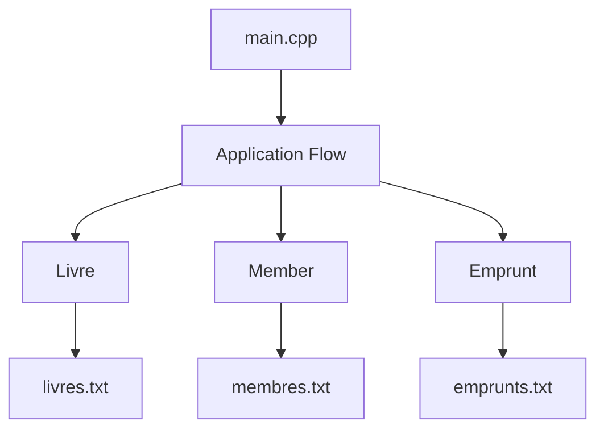

# C++ Library Management System

A console-based library management system built in C++ using object-oriented programming and file-based data persistence.

## Project Purpose

This project was developed to design and implement a structured library management system capable of:

- Managing books (creation, storage, retrieval)
- Registering and managing members
- Handling borrowing and returning operations
- Persisting data using text files

The objective was to apply OOP principles in a real-world structured application.

## System Architecture

The application follows a modular OOP design:

- `Livre` → Represents a book
- `Member` → Represents a registered user
- `Emprunt` → Handles borrowing logic
- `main.cpp` → Entry point and application control flow

Data is stored using:
- `livres.txt`
- `membres.txt`
- `emprunts.txt`

## Architecture (High level)
## Architecture (High level)

## Technical Concepts Applied

## Technical Concepts Applied

- Object-Oriented Programming (Encapsulation, Abstraction)
- Header / Implementation separation (.h / .cpp)
- File I/O handling
- Modular code organization

## Compilation

Using g++:

g++ main.cpp Livre.cpp Member.cpp Emprunt.cpp -o library

## Author

Ojong Bessong NKONGHO  
BSc Computer Science & Engineering
