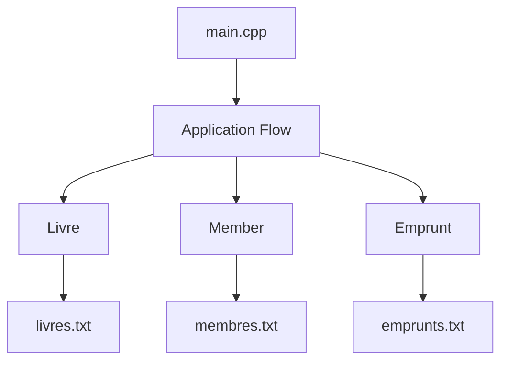

# C++ Library Management System

A console-based library management system built in C++ using object-oriented design principles and file-based data persistence.

## Project Context

This project was developed as part of my academic training to apply structured software design, modular architecture, and object-oriented programming in a real-world scenario.

## Project Overview

The system simulates a basic library environment and supports:

- Book management (creation, storage, retrieval)
- Member registration and management
- Borrowing and return operations
- Persistent storage using structured text files

The goal was to design a clean, modular application with clear separation of responsibilities between components, while implementing core OOP concepts such as encapsulation and abstraction.

## System Architecture

The application follows a modular OOP design:

- `Livre` → Represents a book
- `Member` → Represents a registered user
- `Emprunt` → Handles borrowing logic
- `main.cpp` → Entry point and application control flow

Data is stored using:
- `livres.txt`
- `membres.txt`
- `emprunts.txt`

 ## Architecture Overview

The system follows a modular object-oriented structure with file-based persistence.

## Technical Concepts Applied

- Object-Oriented Programming (Encapsulation, Abstraction)
- Header / Implementation separation (.h / .cpp)
- File I/O handling
- Modular code organization

## Compilation

Using g++:

g++ main.cpp Livre.cpp Member.cpp Emprunt.cpp -o library

## Author

Ojong Bessong NKONGHO  
BSc Computer Science & Engineering
